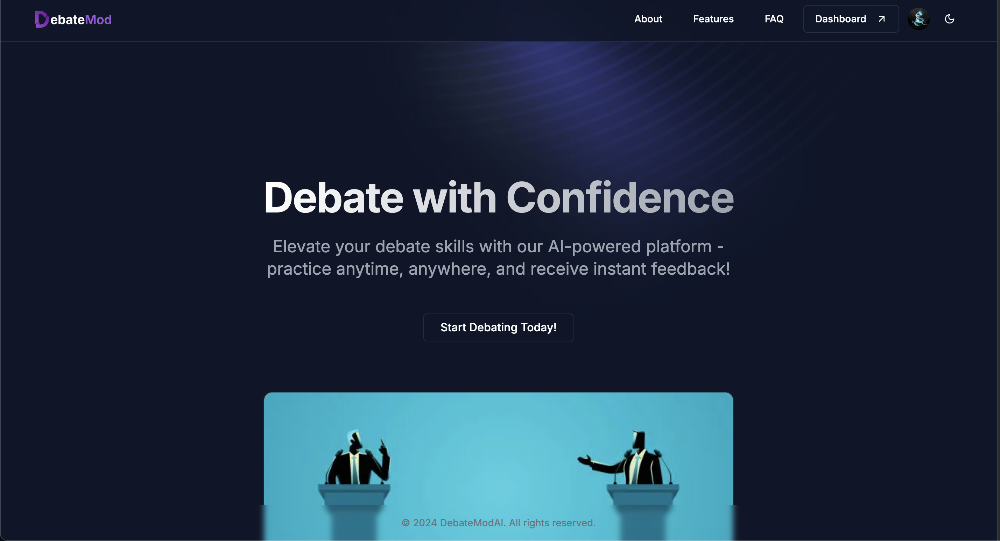
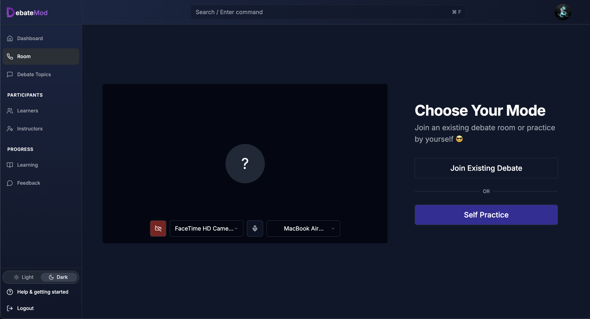

# DebateModAI

A modern SaaS platform for debate practice and skill development, featuring AI-powered feedback and real-time video debates.

## Overview

DebateModAI is a comprehensive platform that helps users improve their debate and presentation skills through:
- Self-paced practice with AI opponents
- Video debates with real participants and AI moderation
- Curated learning content (videos, articles, tutorials)
- Performance analytics and feedback
- (Coming soon) Coach-learner connections

(landing)

(app room preview)

## Tech Stack

### Frontend
- Next.js 15.0 with TypeScript
- UI Components:
  - Radix UI primitives
  - Tailwind CSS
  - Framer Motion for animations
- Authentication via Clerk
- Firebase for real-time features
- LiveKit for video conferencing

### Backend
- FastAPI with Python
- LiveKit Server for WebRTC handling
- OpenAI for AI moderation and feedback
- Strapi CMS (self-hosted) for content management

## Key Features

### Self-Practice Mode
- Practice debates against an AI opponent
- Real-time speech analysis and feedback
- Performance metrics and improvement suggestions

### Video Debates (Coming Soon)
- Live debates with other participants
- AI-powered moderation
- Real-time performance analysis
- Post-debate feedback and review

### Learning Resources
- Curated educational content
- Video tutorials and guides
- Expert articles and tips
- Progress tracking

## Getting Started

### Prerequisites
- Node.js 18+
- Python 3.8+
- OpenAI API key
- LiveKit account
- Firebase project
- Clerk account
