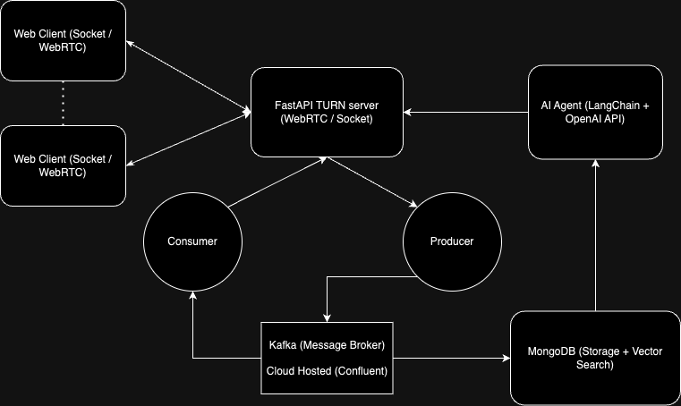

# DebateModAI

A real-time chat application with AI-powered moderation capabilities, leveraging modern architecture and scalable message processing.

## Architecture Overview

The system consists of the following key components:
- Web Clients using Socket/WebRTC for real-time communication
- FastAPI TURN server handling WebRTC/Socket connections
- Kafka message broker for reliable message processing
- MongoDB for storage and vector search capabilities
- AI Agent powered by LangChain and OpenAI API

## Features

- Real-time chat functionality using WebRTC/WebSocket
- Scalable Pub / Sub model for message processing with Kafka
- Vector search capabilities for efficient message retrieval
- Persistent storage with MongoDB

## Tech Stack

### Frontend
- Next.js
- WebRTC API

### Backend
- FastAPI
- Apache Kafka
- MongoDB
- LangChain
- OpenAI API

## 

## Getting Started

### Prerequisites
- Node.js and npm
- Python 3.8+
- MongoDB
- Kafka (Confluent Cloud account)
- OpenAI API key

### Installation
*Coming soon*

## License
This project is licensed under the [MIT License](LICENSE).

## Acknowledgments
*Coming soon*
